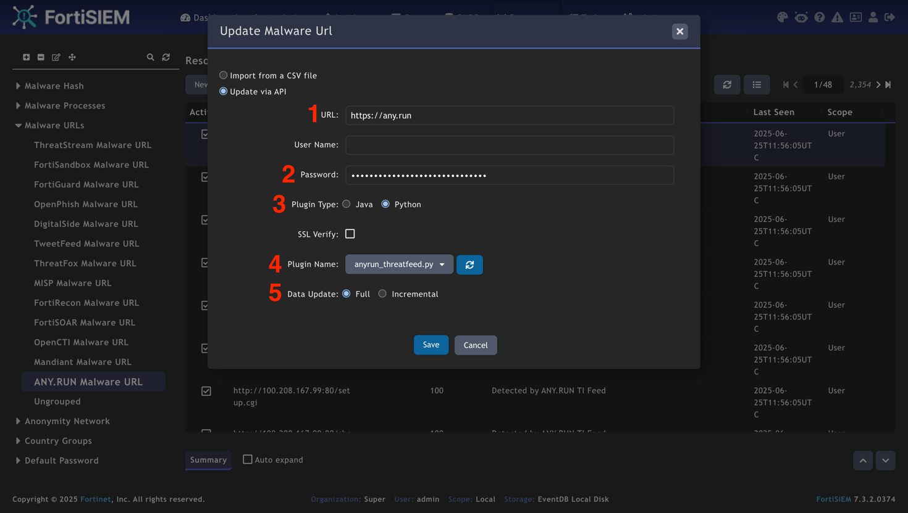
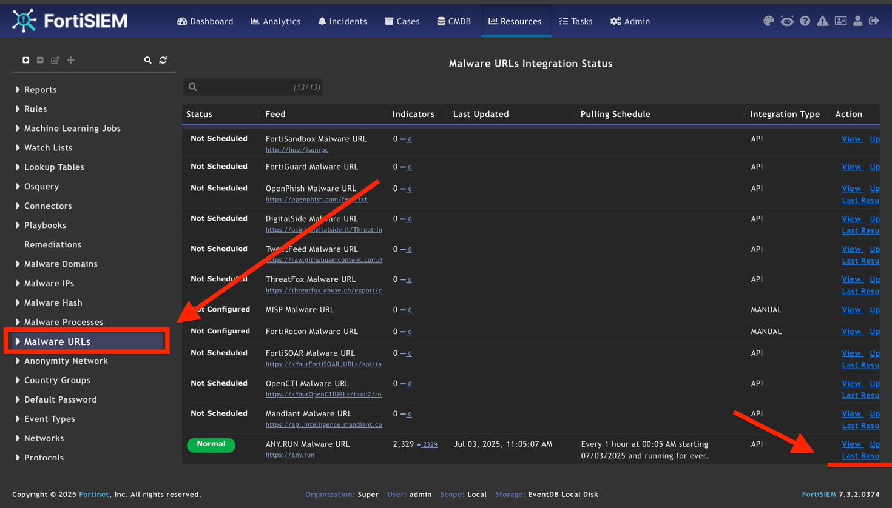
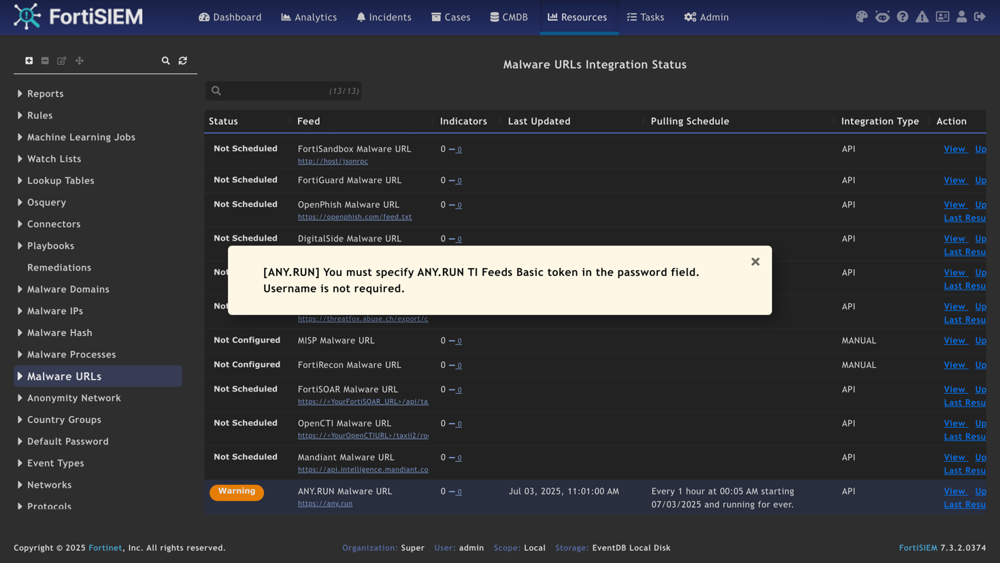

<p align="center">
    <a href="#readme">
        
    </a>
</p>

______________________________________________________________________


# Threat Intelligence Feeds (TI Feeds) by ANY.RUN
TI Feeds help MSSPs and SOCs fortify their security with filtered, high-fidelity indicators of compromise (IPs, domains, URLs) enriched with context from ANY.RUN’s Interactive Sandbox.  

Sourced from real-time sandbox investigations of active attacks across 15,000+
organizations, TI Feeds integrate seamlessly with SIEMs/XDRs/firewalls and other
security solutions to monitor and identify malware and phishing threats.

ANY.RUN’s feeds are updated in real time, allowing you to track threats as they
emerge, develop, and spread to take critical security actions early.  

* Unique data: Fresh indicators from live detonations of attacks with links to sandbox sessions with full threat context, including TTPs.
* No false alerts: TI Feeds provide reliable IOCs with a near-zero false positive rate thanks to pre-processing.
* Prioritization of incidents: SOC teams use TI Feeds as part of alert triage, incident response, and proactive hunting to effectively handle urgent threats.  

TI Feeds are available for integration using STIX/TAXII connectors, as well as API and SDK.
For more details, feel free to [contact us](https://app.any.run/contact-us/?utm_source=anyrungithub&utm_medium=documentation&utm_campaign=fortisiem&utm_content=linktocontactus).  


# How to Integrate TI Feeds with FortiSIEM  

## 1. Copy the Python script to the FortiSIEM host.
```bash
# Clone the project
$ git clone git@github.com:anyrun/anyrun-integration-fortinet.git
$ cd anyrun-integration-fortinet/FortiSIEM

# Copy the Python script to the FortiSIEM host
$ scp anyrun_threatfeed.py [host]@[port]:/opt/phoenix/data-definition/threatfeedIntegrations/anyrun_threatfeed.py
```

## 2. Install the ANY.RUN SDK package on the FortiSIEM host.
* Actual [Python >= 3.9] (Recommended)
```bash
# Connect to the FortiSIEM host and install ANY.RUN SDK package using python3.9 interpreter.
$ pip3.9 install anyrun-sdk
```

* Legacy [Python < 3.9]
```bash
# Clone the SDK project
$ git clone git@github.com:anyrun/anyrun-sdk.git 
$ cd anyrun

# Switch to the legacy sdk version
$ git checkout legacy 

# Prepare virtual environment
$ python3 -m venv venv 
$ source venv/bin/activate
$ pip install build

# Build binaries
$ python -m build
$ cd dist

# Copy binaries to the FortiSIEM host
$ scp anyrun_sdk-[sdk-version]-py3-none-any.whl [host]@[port]:/anyrun_sdk-[sdk-version]-py3-none-any.whl

# Connect to the FortiSIEM host and install ANY.RUN SDK package using default python interpreter.
$ pip3 install /anyrun_sdk-[sdk-version]-py3-none-any.whl
```

## 3. Open FortiSIEM and go to the Resources tab.
 


## 4. In this tab, you can configure the connector to receive URLs, IPs, and domains. We will use the example of URLs.
Open Malware URLs dropdown menu and select ANY.RUN’s connector — **ANY.RUN Malware URL**.
 

## 5. Click **More** and then **Update** in the menu above.
 

## 6. Select **Update via API** and click the Edit icon.
 

## 7. Fill in the following fields:  

* **URL**: Insert https://any.run.
* **Password**: Paste the authorization token for ANY.RUN’s TI Feeds (without the "Basic" prefix).  

If you don’t have these credentials, contact your account manager at ANY.RUN or fill out [this form](https://any.run/demo/?utm_source=anyrungithub&utm_medium=documentation&utm_campaign=fortisiem&utm_content=linktodemo).  

* **Plugin Type**: Select the type of the connector type—Python.
* **Plugin Name**: Select the connector’s script using dropdown menu: anyrun_threatfeed.py.
* **Data Update**: Select data update algorithm—Full.  

Click Save.
 

## 8. Configure the connector scheduler by clicking the **Add** button.
 

## 9. Setup the Schedule. Recommended options to choose:  

* **Recurrence Pattern**: Hourly
* Every 2 hour(s)
* **Recurrence Range**: No end date  

Save changes.
 

## 10. To view the executing status of the connector, click **Malware URLs**, then **Last Result**.
 

## Note 

Upon scheduling the connector for the first time, you might see an error message
indicating that you’ve entered a wrong authorization token. In this case, re-enter the
token and relaunch the connector.  

 

If you have any questions, contact us via [this form](https://app.any.run/contact-us/?utm_source=anyrungithub&utm_medium=documentation&utm_campaign=fortisiem&utm_content=linktocontactus) or write to [support@any.run](mailto:support@any.run) 
 